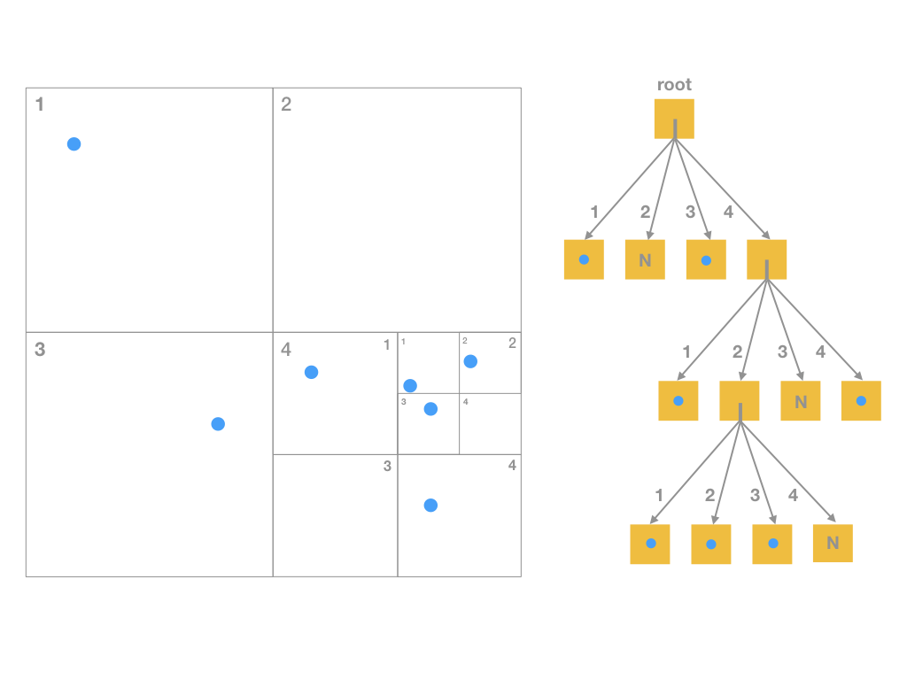
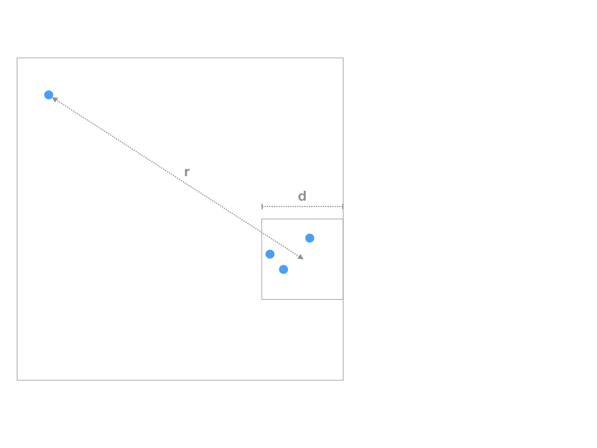
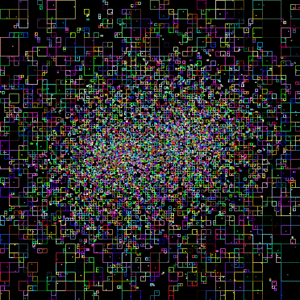

# PlanetSimulation
Description: Simulation of planets movement through octree datastructure and Barnes-Hut-algorithm.
- (from a former software project at the Vienna University of Technology)

## Datenstruktur: Octree

Wie werden die Gruppen gefunden, die man zusammenfassen kann? Eine geeignete Datenstruktur ist der Quadtree in 2D bzw. der Octree in 3D. Die Konzepte des Quadtrees sind:

1. Der erste Schritt ist, alle Himmelskörper der Simulation in eine Baumstruktur (den Quadtree bzw. Octree) einzufügen. Das Einfügen geschieht rekursiv: Ist ein Knoten leer (N), wird der Himmelskörper eingefügt und es entsteht dabei ein Blattknoten, der genau einen Himmelskörper enthält. Ist der Knoten, in den eingefügt wird, ein Blattknoten mit genau einem Himmelskörper, wird der Blattknoten in vier - zunächst leere - Quadranten geteilt und beide Himmelskörper in die entsprechenden Quadranten eingefügt. Jeder Quadrant entspricht einem Unterbaum. Zur Vermeidung mehrfacher Berechnungen sollte jeder Knoten (auf jeder Ebene des Baumes) Gesamtmasse und Schwerpunkt der enthaltenen Himmelskörper in einer Variable speichern. Die Größen werden beim Einfügen aktualisiert.

2. Berechnung der Schwerkraft: Für jeden Himmelskörper wird die auf ihn wirkende Kraft berechnet. Dabei wird die Baumstruktur ausgenutzt. Für Teilbäume, deren Quadranten die Eigenschaften erfüllen, das heißt, vom Himmelskörper weit genug entfernt sind, kann die Kraft, die vom Quadranten ausgeht, ermittelt werden, ohne den Baum weiter hinab steigen zu müssen. Es wird also beim Traversieren des Baumes getestet, ob ein Quadrant die Eigenschaft erfüllt. Ist das nicht der Fall, werden - solange es noch welche gibt - alle Unterquadranten geprüft, im ungünstigsten Fall bis zu den Blattknoten. Das bedeutet, dass man für T = 0 die gleiche Lösung bekommt, wie bei der direkten Aufsummierung aller Kräfte (aufgrund der Verwaltung der Daten durch den Baum jedoch noch langsamer).

3. Nachdem alle Himmelskörper gemäß der auf sie wirkenden Kräfte bewegt wurden, muss der gesamte Baum neu aufgebaut werden, das heißt, Punkt 1 und 2 werden in der Simulation in einer Schleife wiederholt.

## Algorithmus: Barnes-Hut
J. Barnes und P. Hut: ''A hierarchical O(N log N) force-calculation algorithm'' in _Nature_, 324:446-449, 1986 (kann im TU VPN heruntergeladen werden).

## Final result (also visible in .jar)

